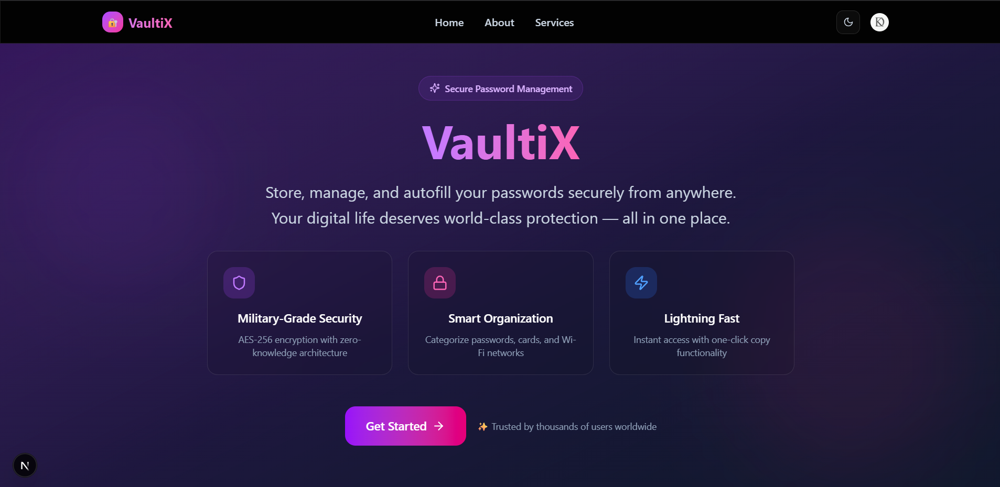
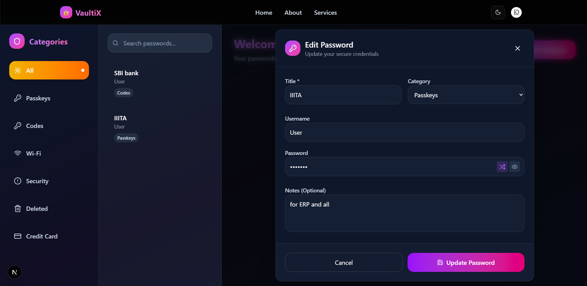

<div align="center">

# 🔐 VaultiX

### Your Passwords. Your Rules. Zero Compromise.

[](https://nextjs.org/)
[](https://react.dev/)
[](https://www.typescriptlang.org/)
[](https://tailwindcss.com/)
[](https://www.mongodb.com/)
[](https://clerk.com/)
[](https://vercel.com/)

<br/>

**VaultiX** is a modern, full-stack password manager that combines **AES-256 encryption** with a **zero-knowledge architecture** — meaning not even the server can read your data. Built with the latest web technologies for speed, security, and a beautiful user experience.

<br/>

[**🌐 Live Demo**]()

</div>

---

## 📸 Screenshots

<div align="center">

### 🏠 Landing Page


<br/><br/>

### 🗄️ Vault Dashboard


</div>

---

## ✨ Features at a Glance

| Feature | Description |
| :--- | :--- |
| 🔐 **Military-Grade Encryption** | AES-256 encryption with a zero-knowledge architecture — your data stays yours |
| 📱 **Cross-Platform Access** | Responsive design works seamlessly on desktop, tablet, and mobile |
| ⚡ **Lightning Fast** | Sub-200ms response times powered by Next.js 15 Turbopack |
| 🎯 **Smart Organization** | Categorize into Passwords, Passkeys, Codes, Wi-Fi, Credit Cards & more |
| 📋 **One-Click Copy** | Instantly copy credentials without revealing sensitive data |
| 🎲 **Password Generator** | Generate strong, cryptographically secure passwords on demand |
| 👁️ **Secure Visibility Toggle** | Peek at passwords with a single click, hidden by default |
| 🔄 **Real-Time Sync** | Cloud-based storage keeps your vault in sync across all devices |
| 🗑️ **Soft Delete & Recovery** | Deleted items are recoverable — never lose a password by accident |
| 🔍 **Instant Search** | Filter and find credentials in milliseconds |
| 🌙 **Dark Mode** | Beautiful dark-themed UI that's easy on the eyes |

---

## 🛠️ Tech Stack

<div align="center">

```
┌────────────────────────────────────────────────────────────────┐
│                        FRONTEND                                │
│  Next.js 15 · React 19 · TypeScript · Tailwind CSS 4           │
│  Lucide React Icons                                            │
├────────────────────────────────────────────────────────────────┤
│                      AUTHENTICATION                            │
│  Clerk                                                         │
├────────────────────────────────────────────────────────────────┤
│                        DATABASE                                │
│  MongoDB with Mongoose                                         │
├────────────────────────────────────────────────────────────────┤
│                      DEPLOYMENT                                │
│  Vercel                                                        │
└────────────────────────────────────────────────────────────────┘
```

</div>

| Layer | Technologies |
| :--- | :--- |
| **Framework** | Next.js 15|
| **UI Library** | React 19 |
| **Language** | TypeScript 5 |
| **Styling** | Tailwind CSS 4, tw-animate-css |
| **Components** | Radix UI (Dropdown Menu, Slot), Lucide React Icons |
| **Theming** | next-themes (Dark/Light mode) |
| **Auth** | Clerk (SSO, session management, middleware) |
| **Database** | MongoDB with Mongoose  |


---

## 🚀 Getting Started

### Prerequisites

- **Node.js** 18 or higher
- **npm** / **yarn** / **pnpm** / **bun**
- **MongoDB** database (local or [MongoDB Atlas](https://www.mongodb.com/atlas))
- **Clerk** account for authentication keys ([clerk.com](https://clerk.com/))

### 1️⃣ Clone the Repository

```bash
git clone https://github.com/kd5778/VaultiX.git
cd VaultiX
```

### 2️⃣ Install Dependencies

```bash
npm install
# or
yarn install
# or
pnpm install
```

### 3️⃣ Configure Environment Variables

Create a `.env.local` file in the project root:

```env
# MongoDB
MONGODB_URI=your_mongodb_connection_string

# Clerk Authentication
NEXT_PUBLIC_CLERK_PUBLISHABLE_KEY=your_clerk_publishable_key
CLERK_SECRET_KEY=your_clerk_secret_key
```

### 4️⃣ Run the Development Server

```bash
npm run dev
```

Open [http://localhost:3000](http://localhost:3000) in your browser — you're all set! 🎉

---

## 📁 Project Structure

```
VaultiX/
│
├── app/                        # Next.js 15 App Router
│   ├── layout.tsx              # Root layout with Clerk & theme providers
│   ├── page.tsx                # Landing page
│   ├── dashboard/              # 🗄️  Main vault dashboard
│   ├── about/                  # ℹ️  About page
│   ├── services/               # 📋 Services page
│   └── sign-in/                # 🔑 Authentication pages
│
├── components/                 # Reusable React components
│   ├── ui/                     # Primitives (Button, Dropdown, etc.)
│   ├── Navbar.tsx              # Navigation bar with theme toggle
│   └── PasswordModal.tsx       # Add/Edit password modal
│
├── lib/                        # Utility functions & DB connection
│   └── utils.ts                # Helper utilities (cn, etc.)
│
├── models/                     # Mongoose schemas
│   └── Password.ts             # Password document model
│
├── pages/api/                  # API routes (REST endpoints)
│   └── passwords/
│       ├── add.ts              # POST   — Create password
│       ├── get.ts              # GET    — Fetch all passwords
│       ├── update/[id].ts      # PUT    — Update password
│       └── delete/[id].ts      # DELETE — Remove password
│
├── public/                     # Static assets
│   └── screenshots/            # App screenshots
│
├── middleware.ts                # Clerk auth middleware
├── next.config.ts              # Next.js configuration
├── tailwind.config.ts          # Tailwind CSS configuration
├── tsconfig.json               # TypeScript configuration
└── package.json                # Dependencies & scripts
```

---

## 🔧 API Reference

All endpoints require authentication via Clerk.

| Method | Endpoint | Description |
| :---: | :--- | :--- |
| `POST` | `/api/passwords/add` | Create a new password entry |
| `GET` | `/api/passwords/get` | Retrieve all passwords for the authenticated user |
| `PUT` | `/api/passwords/update/[id]` | Update an existing password by ID |
| `DELETE` | `/api/passwords/delete/[id]` | Delete a password by ID |

### Request Example — Add Password

```json
POST /api/passwords/add
{
  "title": "GitHub",
  "username": "kd5778",
  "password": "encrypted_password_string",
  "category": "Codes",
  "notes": "Main dev account"
}
```

---

## 🔒 Security Architecture

```
┌─────────────┐     HTTPS/TLS      ┌──────────────┐     Encrypted      ┌─────────────┐
│   Browser   │ ◄───────────────►  │  Next.js API │ ◄────────────────► │   MongoDB   │
│  (Client)   │                    │   (Server)   │                    │  (Storage)  │  
└─────────────┘                    └──────────────┘                    └─────────────┘
       │                                  │
       │  Clerk JWT Tokens                │  Mongoose ODM
       │  Session Management              │  Input Validation
       │  CSRF Protection                 │  XSS Sanitization
       ▼                                  ▼
┌─────────────┐                    ┌──────────────┐
│  Clerk Auth │                    │  AES-256     │
│  Provider   │                    │  Encryption  │
└─────────────┘                    └──────────────┘
```

- **AES-256 Encryption** — All sensitive data is encrypted before storage
- **Zero-Knowledge Architecture** — The server never has access to plaintext passwords
- **Clerk Authentication** — Industry-standard auth with SSO, MFA, and session management
- **Middleware Protection** — Routes are protected at the edge via `middleware.ts`
- **Input Validation** — Comprehensive server-side validation on all API endpoints
- **XSS & CSRF Protection** — Built-in Next.js security headers and Clerk token verification

---

## 🎨 Design Philosophy

VaultiX follows a **premium dark-mode-first** design language:

- **🎨 Color Palette** — Rich purple-to-pink gradients on a deep dark background
- **✨ Glassmorphism** — Frosted glass card effects with subtle backdrop blur
- **🔤 Typography** — Clean hierarchy with readable, modern font stacks
- **🎭 Micro-Animations** — Smooth hover transitions and interactive feedback
- **📐 Responsive** — Mobile-first layouts that scale beautifully to ultrawide

---


## 👨‍💻 Author

<div align="center">

**Krish Dhaked**

[](mailto:krishdhaked777@gmail.com)
[](https://github.com/kd5778)
[](https://linkedin.com/in/krishdhaked5778)

</div>

---

## 🙏 Acknowledgments

- [Next.js](https://nextjs.org/) — The React framework for production
- [React](https://react.dev/) — A JavaScript library for building user interfaces
- [Clerk](https://clerk.com/) — Authentication and user management
- [Tailwind CSS](https://tailwindcss.com/) — Utility-first CSS framework
- [MongoDB](https://www.mongodb.com/) — NoSQL database
- [Radix UI](https://www.radix-ui.com/) — Unstyled, accessible UI primitives
- [Lucide](https://lucide.dev/) — Beautiful & consistent icon toolkit
- [Vercel](https://vercel.com/) — Deployment and hosting platform
